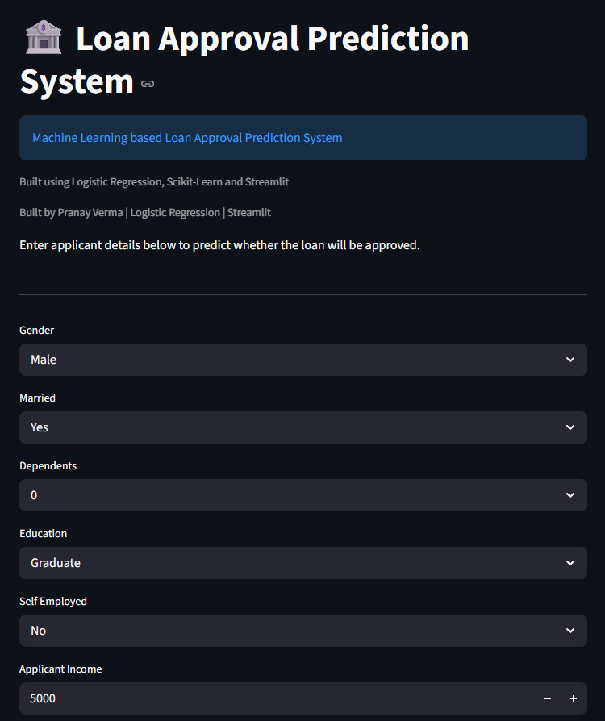
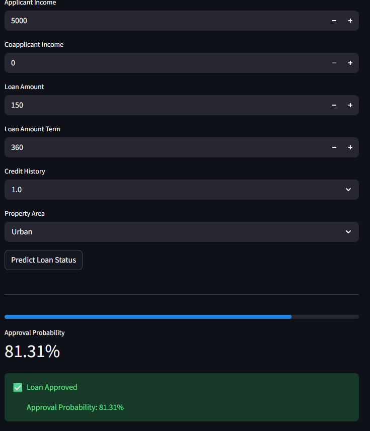
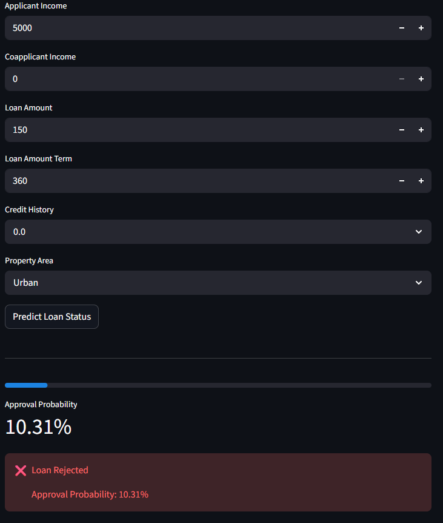
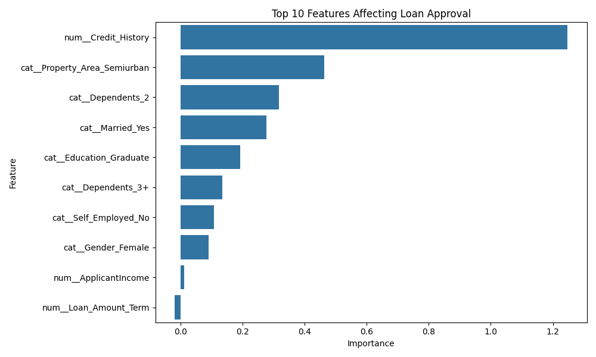

# 🏦 Loan Approval Prediction System


End-to-End Machine Learning Loan Approval Prediction System using Python, Scikit-Learn, XGBoost and Streamlit.

## 🚀 Live Features

- Loan Approval Prediction
- Approval Probability Score
- Feature Importance Analysis
- Interactive Streamlit Dashboard
- Multiple ML Models Comparison

---

## 📌 Project Overview

This project predicts whether a loan application should be approved or rejected using Machine Learning.

The system analyzes applicant information such as:

- Gender
- Marital Status
- Dependents
- Education
- Employment Status
- Applicant Income
- Coapplicant Income
- Loan Amount
- Loan Term
- Credit History
- Property Area

and predicts the loan approval status.

---

## 🎯 Objective

Build an end-to-end Machine Learning pipeline for loan approval prediction and deploy it using Streamlit.

---

## 📂 Dataset

Loan Prediction Dataset from Kaggle.

Target Variable:

- Loan_Status (Y/N)

---

## 🛠 Technologies Used

- Python
- Pandas
- NumPy
- Matplotlib
- Seaborn
- Scikit-Learn
- XGBoost
- Streamlit
- Joblib

---

## 📊 Exploratory Data Analysis

Performed:

- Missing Value Analysis
- Distribution Analysis
- Correlation Analysis
- Outlier Detection
- Approval Trend Analysis

Visualizations created using:

- Matplotlib
- Seaborn

---

## ⚙ Data Preprocessing

Implemented:

- Missing Value Imputation
- One-Hot Encoding
- Feature Scaling
- Train-Test Split
- Scikit-Learn Pipelines

---

## 🤖 Models Trained

1. Logistic Regression
2. Decision Tree
3. Random Forest
4. XGBoost

---

## 📈 Model Performance

| Model | Accuracy | Precision | Recall | F1 Score | ROC-AUC |
|---------|---------|---------|---------|---------|---------|
| Logistic Regression | 86.18% | 84.00% | 98.82% | 90.81% | 85.23% |
| Random Forest | 82.11% | 84.62% | 90.59% | 87.50% | 78.08% |
| XGBoost | 82.11% | 83.16% | 92.94% | 87.78% | 75.63% |
| Decision Tree | 75.61% | 82.35% | 82.35% | 82.35% | 71.44% |

### 🏆 Best Model

Logistic Regression

Accuracy: 86.18%

---

## 🔍 Feature Importance

Most influential features:

1. Credit History
2. Property Area (Semiurban)
3. Dependents
4. Marital Status
5. Education

---

## 🌐 Streamlit Web Application

Features:

- User-friendly interface
- Real-time prediction
- Approval probability
- Interactive inputs

---

## 📸 Application Screenshots

### 🏠 Home Screen



### ✅ Loan Approved Prediction



### ❌ Loan Rejected Prediction



---

## 📊 Feature Importance



## 🚀 How to Run

### Clone Repository

```bash
git clone https://github.com/pranayv-09/Loan-Approval-Prediction-System.git
cd Loan-Approval-Prediction-System
```

### Create Virtual Environment

```bash
python -m venv venv
```

### Activate Environment

Windows:

```bash
venv\Scripts\activate
```

Linux / macOS:

```bash
source venv/bin/activate
```

### Install Dependencies

```bash
pip install -r requirements.txt
```

### Run Application

```bash
streamlit run app.py
```

---

## 📁 Project Structure

```text
Loan_Approval_Prediction/
│
├── data/
├── models/
├── notebooks/
├── reports/
├── src/
├── app.py
├── requirements.txt
├── README.md
└── .gitignore
```

---

## 🔮 Future Improvements

- Hyperparameter Tuning
- Model Deployment on Cloud
- Explainable AI (SHAP)
- User Authentication
- Database Integration

---

## 👨‍💻 Author

Pranay Verma